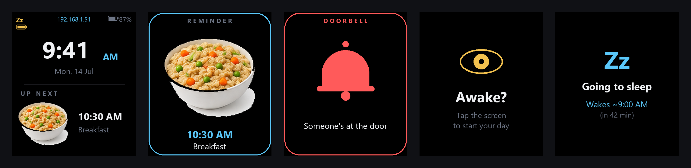
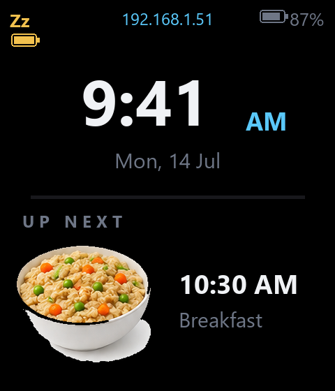
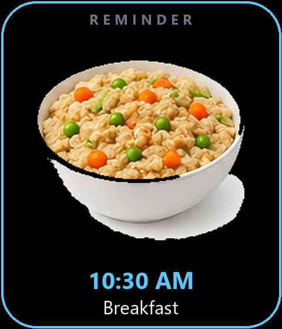
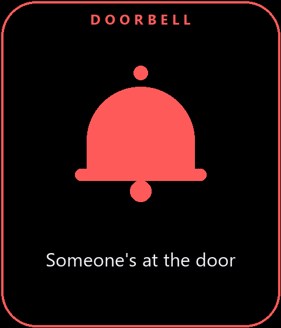
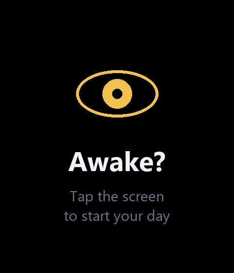
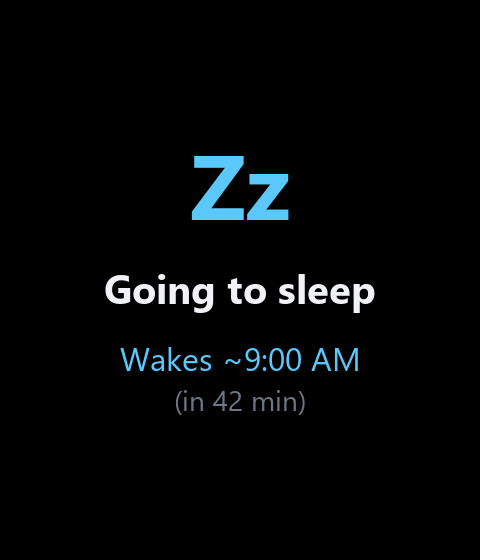
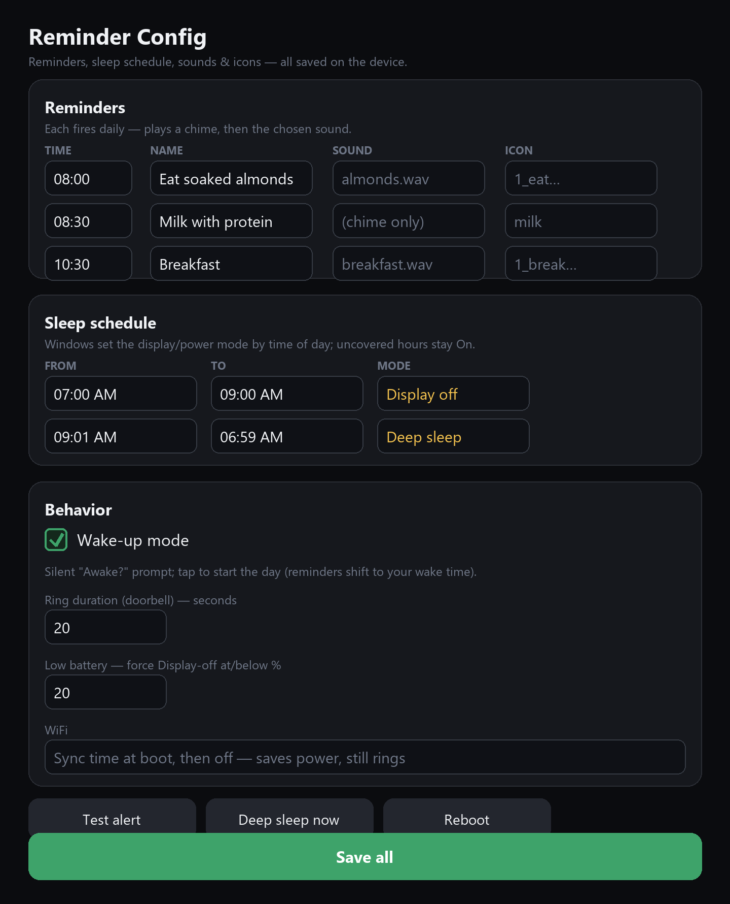

# ReminderESP32 🍽️⏰

A **set‑and‑forget daily reminder appliance** on the **[Waveshare ESP32‑C6‑LCD‑1.69](https://www.waveshare.com/esp32-c6-lcd-1.69.htm)**
(240×280 IPS). It shows a clock and your next reminder, and at each scheduled time it
throws up a **full‑screen food image + label**, plays a **chime then a voice prompt**,
and rings until you **tap it** to dismiss (no touchscreen — it uses the onboard motion
sensor). Everything is configured from a **built‑in web page** — reminders, sounds,
icons, a day/night **sleep schedule**, and a **wake‑up mode**. It even doubles as a
**wireless doorbell** display over ESP‑NOW.

The clock **sets itself from the internet** (NTP) and is backed by an onboard **RTC**,
so it never drifts and survives power cuts — and keeps working with **no Wi‑Fi at all**.



---

## ✨ Features

- **Daily reminders** — full‑screen image + name, chime + optional spoken WAV, rings until you tap to dismiss.
- **No touchscreen needed** — tap anywhere on the device; the **QMI8658 IMU** detects the tap (adjustable sensitivity).
- **Built‑in web config** — edit the schedule, upload sounds & icons, set everything from your phone/laptop. Nothing to reflash.
- **Self‑setting clock** — NTP over Wi‑Fi + onboard **PCF85063 RTC** backup. Boots and runs from the RTC even with no Wi‑Fi.
- **Wireless doorbell** — a separate battery button broadcasts a “ring” over **ESP‑NOW**; the display shows a wiggling bell + a doorbell sound.
- **Sleep schedule** — per‑time‑of‑day windows: **On / Display‑off / Deep‑sleep** to save battery.
- **Wake‑up mode** — a silent “Awake?” screen; tap it and the whole day’s reminders shift to line up from your wake time (gaps preserved).
- **Battery aware** — on‑screen battery gauge, low‑battery auto power‑saving, and a **USB = always full power** rule.
- **Ring log** — last 100 doorbell rings with date & time, viewable on the web page.
- **Boot summary** — a 3‑second recap of your plan on power‑up.

## 📸 Screenshots

| Home | Reminder alert | Doorbell | Wake‑up | Going to sleep |
|---|---|---|---|---|
|  |  |  |  |  |

**Web config page** (mobile + laptop friendly):



---

## ⚡ Quick install (no tools)

**Flash from your browser** 👉 **[open the Web Flasher](https://hterminal.github.io/Alfred-the-reminder/)**
(Chrome/Edge on desktop): pick a release, plug the board in via USB‑C, pick the port,
and flash — nothing to download.

Prefer a desktop app? Grab the latest **[Release](https://github.com/hterminal/Alfred-the-reminder/releases)** and use the
**one‑click flasher** — `esptool` is bundled, nothing to install:

| OS | Download | Run |
|----|----------|-----|
| Windows | `ReminderESP32-flasher-windows.zip` | double‑click **flash‑windows.bat** |
| macOS | `ReminderESP32-flasher-macos.zip` | double‑click **flash‑mac.command** (right‑click → Open the first time) |
| Linux | `ReminderESP32-flasher-linux.zip` | run **./flash‑linux.sh** |

Plug the board in via USB‑C, run the flasher, then open the **IP shown on the device
screen** to configure it. The binaries are built automatically by
[GitHub Actions](.github/workflows/build.yml) — every version tag (`v*`) publishes a Release.

---

## 🧰 Hardware

| Part | Notes |
|---|---|
| **[Waveshare ESP32‑C6‑LCD‑1.69](https://www.waveshare.com/esp32-c6-lcd-1.69.htm)** | the main display. ST7789V2 240×280, ES8311 audio codec + speaker, PCF85063 RTC, QMI8658 IMU, 16 MB flash, Li‑Po connector. — [product page](https://www.waveshare.com/esp32-c6-lcd-1.69.htm) · [wiki/docs](https://www.waveshare.com/wiki/ESP32-C6-LCD-1.69) |
| **A second ESP (optional)** | the wireless doorbell button — a **Seeed XIAO ESP32‑C3** (recommended) or any ESP32/ESP32‑C3 + a push‑button. |
| Li‑Po battery (optional) | for cordless use. See **Power & battery** below — the board has a firmware power‑latch. |

**Key pins on the display board** (already set in `config.h`, taken from the board schematic):

```
LCD ST7789 : CLK 1  MOSI 2  DC 3  RST 4  CS 5  BL 6      (SPI, active-high backlight)
I2C bus    : SDA 8  SCL 7   -> RTC 0x51, ES8311 0x18, IMU 0x6B
I2S audio  : MCLK 19  BCLK 20  WS 22  DOUT 23  DIN 21
Battery    : ADC GPIO0 (reads 1/3 of pack), EN GPIO15 (power-latch, held HIGH by firmware)
Buttons    : BOOT 9   PWR 18
```

---

## 🚀 Build & flash

### Libraries

| Library | Version | Source |
|---|---|---|
| **esp32 board core** | ≥ 3.0 (tested 3.3.10) | *esp32 by Espressif* |
| **lvgl** | **8.3.11** (exact) | by kisvegabor |
| **GFX Library for Arduino** | latest (tested 1.6.6) | by moononournation |
| **SensorLib** | latest | QMI8658 IMU (tap) |
| **ArduinoJson** | 7.x | web config |
| **WiFiManager** | 2.0.17 | by tzapu — phone Wi‑Fi setup portal |

`Wire`, `WiFi`, `WebServer`, `ESP_I2S`, `esp_now` are built into the ESP32 core. The
ES8311 codec driver is **bundled** in `firmware/ReminderESP32/src/es8311/` (no install).

### Windows — one‑liners (recommended)

Everything is scripted with `.bat` files in `firmware/`:

```bat
setup.bat            :: ONE-TIME on a new PC — installs the core + all libraries + lv_conf.h
build_upload.bat     :: compile + flash the display board on COM8
build_upload.bat COM5:: ...on a specific port
build_only.bat       :: just compile (no flashing)
list_ports.bat       :: show which COM port the board is on
flash_button.bat COM9:: flash the doorbell-button firmware onto the SECOND ESP
```

> The scripts fall back to `arduino-cli` on your PATH if the bundled `arduino-cli.exe`
> isn’t present, so install [arduino‑cli](https://arduino.github.io/arduino-cli/) once
> if you’re on a fresh machine.

### The FQBN (important)

```
esp32:esp32:esp32c6:PartitionScheme=custom,CDCOnBoot=cdc,FlashSize=16M
```

- **`FlashSize=16M`** — this board has 16 MB flash; omit it and the bootloader is built for 4 MB → boot loop.
- **`PartitionScheme=custom`** — uses `partitions.csv` (3 MB app + ~13 MB LittleFS for sounds/images).
- **`CDCOnBoot=cdc`** — Serial logs come out the USB‑C port.

### lv_conf.h

`setup.bat` copies the bundled `firmware/lv_conf.h` into your Arduino `libraries/` folder.
It sets `LV_COLOR_DEPTH 16`, `LV_COLOR_16_SWAP 0`, and enables Montserrat fonts 14/16/20/28/48.

---

## ⚙️ First run & configuring

1. Flash it — `build_upload.bat COM8`. **No Wi‑Fi credentials are stored in the
   firmware**, so nothing private ever ships in a build or release. (Timezone
   defaults to India `IST‑5:30` in `config.h`.)
2. **Set up Wi‑Fi from your phone (one time).** On first boot the device raises its
   own hotspot and the screen says **“Hotspot is LIVE — `Alfred-Setup`”** with the
   two steps. On your phone, join the **`Alfred-Setup`** Wi‑Fi; a captive portal
   opens automatically → pick your home network and enter its password. The
   credentials are saved on the device.
   (Powered by [tzapu/WiFiManager](https://github.com/tzapu/WiFiManager).)
   The portal is **non‑blocking** — the clock, reminders, doorbell and USB all keep
   working while it waits, so the device never freezes and you can always reflash it.
   *If you skip setup it simply runs offline from the RTC — reminders still fire.*
3. Once connected the screen shows a **3‑second plan summary**, then the clock, and
   the **IP address** appears at the top (or `offline` if Wi‑Fi isn’t set up).
4. Open that **IP in a browser** → the config page.
5. Moving to a new network later? Use **Reset Wi‑Fi** on the config page — it forgets
   the saved network and reopens the `Alfred-Setup` hotspot.

### The web page

- **Reminders** — a table of Time · Name · Sound · Icon. Add/remove rows, then **Save all**. Each fires daily.
- **Sleep schedule** — time windows, each set to **On / Display‑off / Deep‑sleep**. Uncovered hours stay On.
- **Behavior** — Wake‑up mode, ring duration, low‑battery thresholds, Wi‑Fi mode, tap sensitivity (with a live “tap force” readout).
- **Sounds / Icon images** — upload WAVs and PNG/JPG icons straight from the browser (images are converted to the display format in‑browser). Delete with the × buttons.
- **Ring log** — the last 100 doorbell rings with timestamps.
- **Buttons** — *Test alert*, *Deep sleep now*, *Reboot*, *Reset Wi‑Fi* (reopens the phone setup portal).

Everything is saved to `/config.json` on the device — **no reflashing to change settings.**

### Wake‑up mode

Turn it on and the screen shows a **silent “Awake?”** prompt (no sound) until you **tap**
the device. On tap, the first reminder fires immediately and the **whole day’s reminders
shift** so they line up from your wake moment — **keeping the gaps you configured**
(e.g. if breakfast was 2 h 30 after almonds, it still is). It re‑arms every morning.
Turn it off to go back to your fixed clock times.

---

## 🔔 Doorbell system (ESP‑NOW)

A **second ESP** acts as a wireless doorbell button. When pressed it broadcasts a tiny
`{magic, "ring"}` packet over **ESP‑NOW on every Wi‑Fi channel** (no pairing, no router,
no MQTT). The display listens and, on receiving it, shows a **wiggling bell** + plays the
ring sound for the configured duration, then returns to the clock.

**Button firmware:** `firmware/DoorbellButton/DoorbellButton.ino`

- Default board: **Seeed XIAO ESP32‑C3**. Wire a push‑button between the **D2 pad (GPIO4)** and **3V3** (active‑HIGH). GPIO4 is one of the C3’s deep‑sleep‑capable pins.
- It **deep‑sleeps** between presses and wakes on the button (µA‑level) — after ringing it waits a few seconds, prints “going to sleep”, then sleeps again.
- Flash it:
  ```bat
  flash_button.bat COM9              :: XIAO ESP32-C3 (default)
  flash_button.bat COM9 esp32c3      :: a generic C3
  flash_button.bat COM9 esp32        :: a classic ESP32
  ```

> ⚠️ **C3 deep‑sleep only wakes from GPIO0–5.** The board’s BOOT button (GPIO9) can’t wake
> deep sleep, which is why the wake button lives on **GPIO4 (D2)**. If you want *both* an
> external button **and** BOOT to wake it, that needs light sleep instead — ask.

The magic value must match on both sides (`DOORBELL_MAGIC` in `config.h` / the button sketch).

---

## 🔋 Power & battery

Read straight off the board schematic — these are the non‑obvious bits:

- **GPIO15 (BAT_EN) is a soft power‑latch.** On battery the board is only powered while
  the firmware holds GPIO15 **HIGH** — it drives it HIGH first thing at boot. On USB the
  board is powered regardless (VBUS feeds the system rail).
- **On‑screen battery gauge** — GPIO0 reads ⅓ of the pack voltage; the % shows top‑right.
- **USB = always full power.** Whenever it’s plugged in, the display stays on and Wi‑Fi
  stays connected — the sleep schedule and power‑saving apply **only on battery**.
- **“Deep sleep” on battery is actually light sleep.** True deep sleep on the ESP32‑C6
  would drop GPIO15 and power the board off (it can’t hold a high‑power‑domain pin across
  deep sleep). So the scheduled “Deep sleep” mode uses **light sleep** — it keeps the
  latch alive, blanks the screen, and still wakes for reminders.
- The **“Deep sleep now (test)”** web button does a real `esp_deep_sleep_start()` and wakes
  itself after 20 s — useful for measuring current **on USB** (on battery it powers off).

---

## 🎵 Sounds & 🖼️ images

- **Default WAVs** live in `firmware/data/sounds/` (16 kHz mono 16‑bit, made with `ffmpeg`).
  Reminders fall back to a generated chime if a WAV is missing, so voice prompts are optional.
- The **easy way** to load sounds/icons is the **web page uploaders** — they write into the
  device’s LittleFS filesystem, no reflashing.
- **Icons:** the browser converts any PNG/JPG into the on‑device format (196 px alert +
  104 px preview, RGB565) with a transparent‑background composite on black. Built‑in food
  icons are C arrays under `firmware/ReminderESP32/src/images/`.
- Cropped, transparent product icons are in `firmware/assets/png/1_*.png` if you want to
  upload nicer photos.

---

## 🗂️ Project layout

```
reinderesp/
├─ README.md                     ← you are here
├─ docs/img/                     ← the screenshots above
└─ firmware/
   ├─ ReminderESP32/             ← the DISPLAY firmware (the main sketch)
   │  ├─ ReminderESP32.ino       ← main loop: LVGL, Wi-Fi/NTP, scheduler, power
   │  ├─ config.h                ← timezone, pins, feature toggles (no Wi-Fi password — set from phone)
   │  ├─ ui.*  schedule.*  audio.*  imu.*  rtc.*  espnow.*  webconfig.*  ringlog.*
   │  ├─ partitions.csv          ← 16 MB layout (3 MB app + LittleFS)
   │  └─ src/es8311/  src/images/
   ├─ DoorbellButton/            ← the wireless doorbell BUTTON firmware (2nd ESP)
   ├─ data/sounds/               ← default reminder/ring WAVs (LittleFS)
   ├─ assets/                    ← icon-generation scripts + source PNGs
   ├─ *.bat                      ← setup / build / flash helpers (Windows)
   └─ lv_conf.h                  ← the LVGL config used for this project
```

---

## 🛟 Troubleshooting

| Symptom | Fix |
|---|---|
| Boot loop / `partition exceeds flash chip size` | make sure the FQBN has **`FlashSize=16M`** |
| Colours look swapped | flip `LV_COLOR_16_SWAP` in `lv_conf.h` |
| Everything upside‑down | `LCD_ROTATION` (0/2) in `config.h` |
| Screen blank | pins wrong — this repo’s `config.h` matches the C6‑LCD‑1.69 |
| No sound | check the I2S pins in `config.h`; reminders still work with the built‑in chime |
| I2C scan finds nothing | put the right SDA/SCL first in `I2C_CANDIDATES` (`config.h`) |
| Clock stuck `--:--`, shows `offline` | Wi‑Fi not set up / wrong password — join **`Alfred-Setup`** from a phone to (re)configure, or use *Reset Wi‑Fi*; the RTC still keeps time once seeded |
| Web page unreachable | in Wi‑Fi *“sync then off”* mode the page is only up ~60 s after boot / a Save — press **Reboot** |
| Board won’t stay on from battery | the firmware must be flashed (it holds the GPIO15 power‑latch) — on USB it always runs |
| Uploaded image blank on the alert screen | filenames longer than the icon field truncate — keep icon names short; the firmware rebuilds `<base>.bin` |

Watch the serial log at **115200** baud for `[i2c]`, `[pwr]`, `[wifi]`, `[cfg]`, `[deepsleep]` lines.

---

## Credits

Built for the Waveshare **ESP32‑C6‑LCD‑1.69**. Uses [LVGL](https://lvgl.io),
[Arduino_GFX](https://github.com/moononournation/Arduino_GFX), SensorLib, ArduinoJson,
[WiFiManager](https://github.com/tzapu/WiFiManager) (by tzapu), and Waveshare’s ES8311
driver. Pins verified against the board schematic and the `78/xiaozhi-esp32` board config.

> _AI was used as an assistant while designing and building this project._
